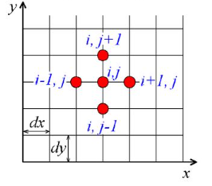

# Solution to a 2D Wave Equation using MPI 

This code solves a 2D Wave equation of the form:

$$ \frac{\partial^2 u}{\partial t^2} - \alpha (\frac{\partial^2 u}{\partial x^2} - \frac{\partial^2 u}{\partial y^2}) = 0$$

Where $u$ is the field variable (amplitude, intensity, wave height) being measured by the equation, and $\alpha$ is the square of the propagation speed of the wave. 

The second term of the above equation, called the 2-D Laplacian, is estimated in a discrete grid using a **5-point stencil**.



This program was tested on the San Diego Supercomputer Center's Expanse cluster which has 728 "standard" compute nodes having 128 CPU cores each.

## Solution Specifics
The problem space is split into rectangular tiles, and each processor in the system is assigned to solve the equation for its own tile. Exchange of values at the boundaries of the tiles, also known as **ghost cell** exchanges between processors, are handled in the code. Note that we use **asynchronous communication** in MPI to exchange the ghost cell values. The .config JSON files inside the [tests](tests/) directory contain the grid setup, as well as co-ordinates for rectangular obstacles that ensure that we see some interesting stuff in the output waveform!

Our findings reveal a preference for processor geometries that reduce the overhead of sideways communication (i.e. more processors along the x-dimension and less along the y-) since sideways communication involves additional overheads of buffering (for more detailed analysis read our project report [here](report/CSE260_PA3_Report.pdf))

### Some Cool Optimizations

- Using Intel SSE2 vector intrinsics to simultaneously compute multiple interior cells in a single instruction

- Computing the values of the interior cells while waiting for the ghost cells to arrive allows us to hide the latency of MPI communication.

## Build Steps
- Ensure that you have CMake on your machine
- Clone the repository
- ```cd``` into the cloned repo and create a new directory
    ```bash
    mkdir build
    ```
- ```cd``` into the build directory and run CMake to generate the build files
    ```bash
    cd build/
    cmake ..
    ```
- Inside the build directory, run ```make``` to build the project or ```make clean``` to clean up any old builds (do this each time you make a code change)

## Execution Steps
- The build process above generates a binary called ```wave260mpi``` that you can run using the ```mpirun``` command

- Mandatory arguments are: a configuration file name (as a start, take any of the ```.config``` JSON files present in the [tests](tests/) directory) and ```-x X -y Y``` to specify the processor geometry

- Run the [makeslurm.py](tests/makeslurm.py) script to generate a SLURM file for use on your own supercomputer infrastructure! (Make sure to modify the hardcoded library paths where needed)

### Note on COPYRIGHT
This work uses code written by Prof. Bryan Chin at the University of California, San Diego. We thank him for his guidance, support and instruction behind this work. 
